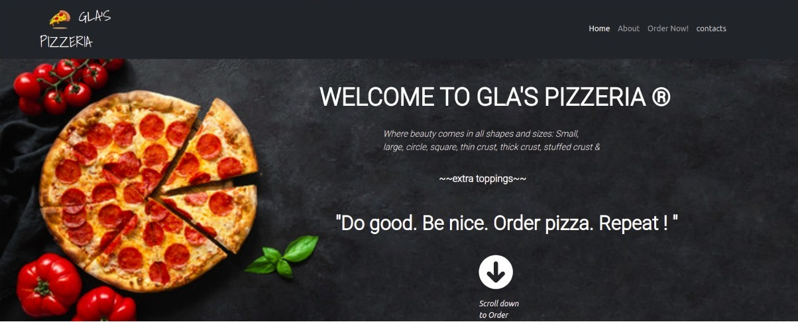

# GLA'S PIZZERIA

### This is an upcoming restaurant in a comfortable, familiar, City of Nairobi that has a strong need for additional dining options. For a start the restaurant will be offering pizza toppings for anyone who orders via Our new app (Gla's Pizzeria).Enjoy!

## Table of Contents

+ [Description](#description)
+ [Installation Requirement](#Installation)
+ [Sitelink](#Name-predictor)
+ [Technology Used](#technology-used)
+ [Reference](#reference)
+ [Licence](#licence)
+ [Authors Info](#author-Info)

## Description

A pizza place that offers the yummiest pizza;s in out. You cant resist! Purchse from us.

## Installation
 To install git in your pc,run (on yout terminal): 
<code>sudo apt update && sudo apt upgrade</code> 
<code>sudo apt install git</code>

If you want to clone this repository to your local machine, use the following command:

<code> git clone https://github.com/gladyswambura/Gla-s-Pizzeria</code>

## Site link
https://github.com/gladyswambura/Gla-s-Pizzeria

### Requirements

* Either a computer,phone,tablet or an Ipad

* An access to the Internet

## Technology Used
* HTML - which was used to build the structure of the pages.

* Bootstrap - which was used to style the pages and make it responsive.

* Java Script- was used to activate the buttons on the page.

* Custom Css- Was used to style the pages in this website.

## Reference
* Materialize CSS
* GetBootstrap.com
* W3-Schools
* jQuery.com

## Licence

MIT License

Copyright (c) [2022] [Gladys Wambura]. All Rights Reserved.
<a href="./LICENSE"> LICENSE</a>

## Authors Info

Slack Profile - [Gladys Wambura](https://stackoverflow.com/users/18241026/gladys-wahito?tab=profile)

Linked - [Gladys Wambura](https://www.linkedin.com/in/gladys-wahito-3480a01ab/)